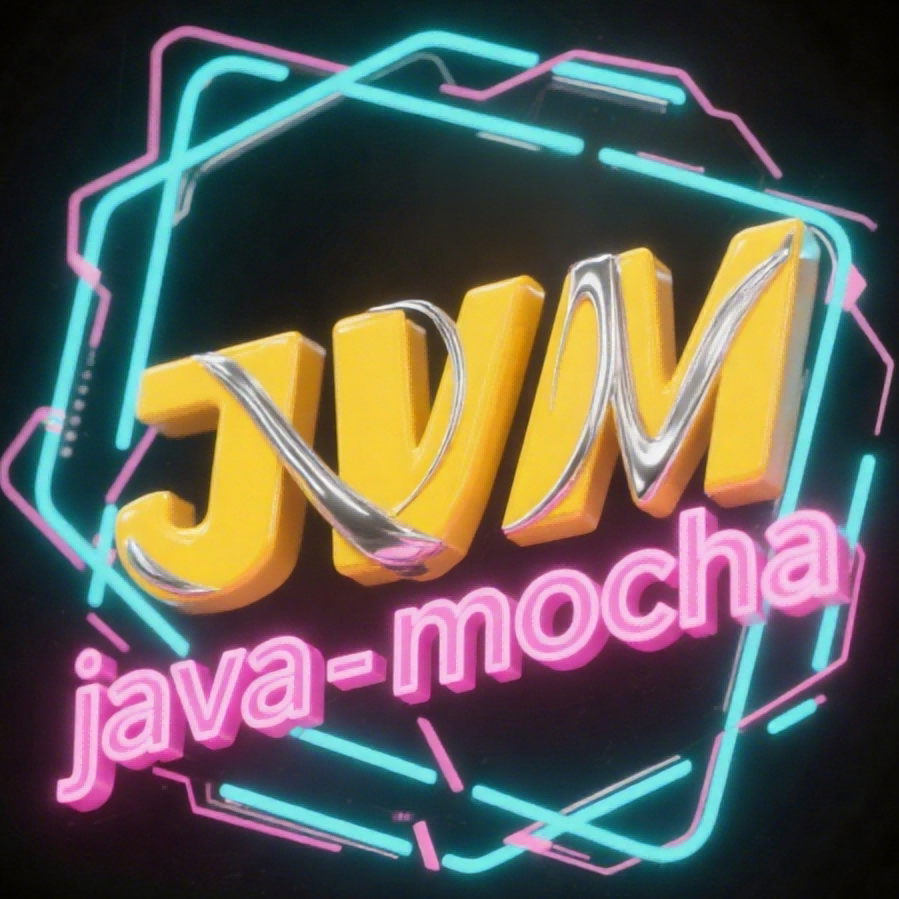

# java-mocha

<div align=center></div>

> A Rust-based JDK version manager that helps you easily install, switch, and manage multiple JDK versions on Windows.

Java-Mocha is a Java version management tool developed based on the Foojay API. It supports JDK version management through a command-line interface and can also be integrated and used via the API.

> Currently, it only supports Oracle and Oracle OpenJDK. If you need to support more JDK vendors or have other improvements, please submit an issue.
## Installation

Support scoop installation.

```bash
# Install the package
scoop bucket add code https://github.com/morning-start/code-bucket
scoop install code/jvm

# Update the package
scoop update jvm
```

## Features

- **Configuration Management**: Configure JDK directories, cache directories, and proxy servers.
- **Data Synchronization**: Synchronize JDK data from Foojay to a local JSON file.
- **List Display**: View local JDKs, publishers, and version information.
- **Query Function**: Query available JDKs based on publishers, version numbers, and support periods.
- **Installation and Uninstallation**: Install and uninstall specified JDK versions.
- **Version Switching**: Switch the JAVA_HOME environment variable to point to a different JDK version.

## Building from Source

To build and run the project from source, you need to have Rust installed on your system.

```bash
# Clone the repository
git clone https://github.com/morning-start/java-mocha.git
cd java-mocha

# Build the project
cargo build --release

# Run the project
cargo run --release
```

## Usage

You can configure the `JVM_ROOT` environment variable in advance to control the installation directory. The default value is `%USERPROFILE%\.java-mocha`.

Notes:

1. Before use, manually configure the `JAVA_HOME` environment variable to `JVM_ROOT/default`.
2. On first use, synchronize the data to obtain the latest JDK data information.

Characteristics:

1. No system permissions are required for use.
2. The software automatically acquires system and architecture information to obtain the corresponding JDK version.
3. JDK information is based on the [foojay Disco API](https://github.com/foojayio/discoapi), providing better scalability.
4. The default is production-free JDKs, excluding commercial versions.
5. Currently, it only handles JDKs without JavaFX.
6. Supported JDK vendors are as follows:
    - Oracle
    - Oracle OpenJDK

### Configuration

```bash
jvm config
```

### Synchronize Data

```bash
jvm sync
```

### View Lists

```bash
# View local JDKs
jvm list

# View publisher information
jvm list --publisher

# View version information
jvm list --version
```

### Query JDKs

```bash
# Query by publisher
jvm query oracle

# Query by publisher and version number
jvm query oracle -v 23

# Query by publisher and support period
jvm query oracle -t sts
```

### Install JDK

```bash
jvm install oracle@23
```

### Switch JDK

```bash
jvm switch oracle@23.0.1
```

### Uninstall JDK

```bash
jvm uninstall oracle@23.0.1
```

## Development Documentation

For more detailed information, please refer to the [Development Documentation](DEVELOP_DOC.md).

## Thanks

- [foojay Disco API](https://github.com/foojayio/discoapi)
